# Email Header Analysis

## Lab Setup

Emails for this section can be downloaded at the link below

[Emails.zip](Files/Emails.zip)

### **Install Thunderbird email client on the Windows machines.**

Download from the link below:

[Thunderbird — Free Your Inbox.](https://www.thunderbird.net/en-US/)

### Install Sublime Text

[Sublime Text - the sophisticated text editor for code, markup and prose](https://www.sublimetext.com/)

Install Sublime Plugin for Email Header

Open Sublime Text Editor and go to Tools and then drop down to Install Package Control.

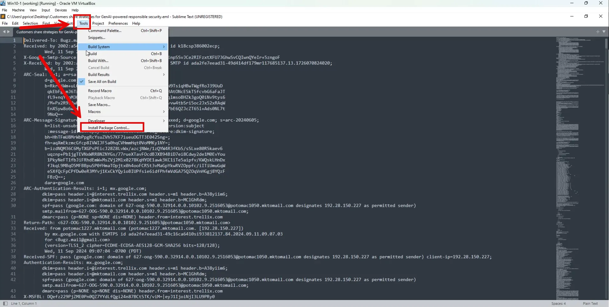

Enter in “Control-Shift-P” and when the input window opens start typing install, you will see the option to select Package Control: Install Package. Select it.


Another input window will open up, type in email and you will see the Email Header email header.

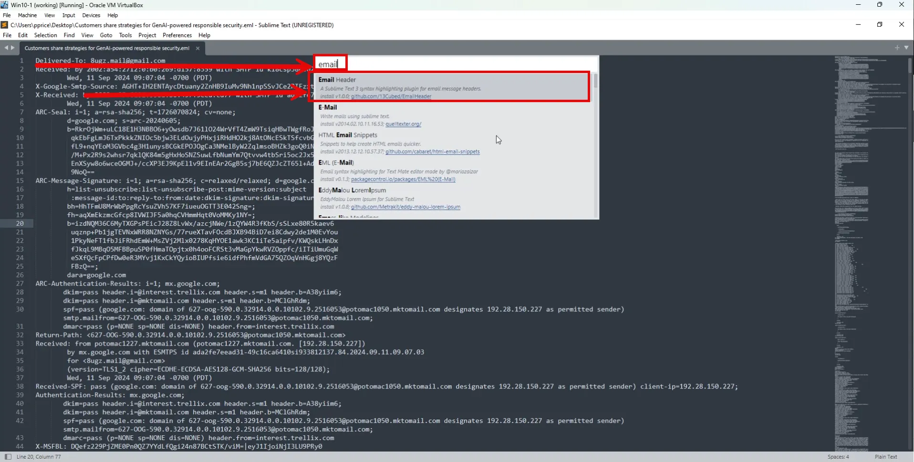

Select the link to the github page and download the latest release.

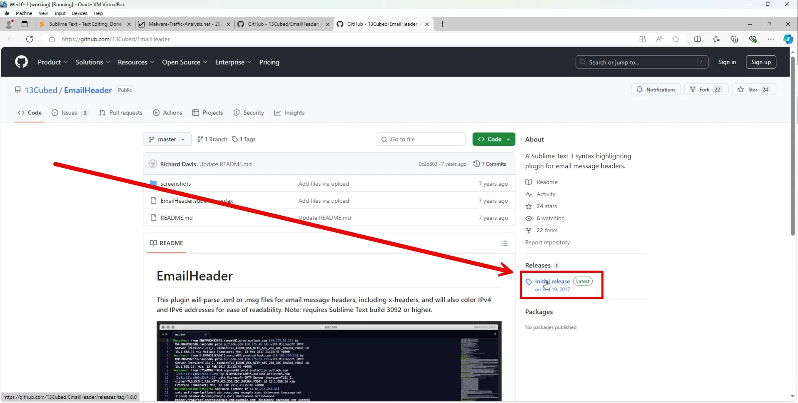

Unzip the file and copy the EmailHeader.sublime-syntax file and paste it in the <Username>\AppData\Roaming\Sublime Text\Packages\User folder.

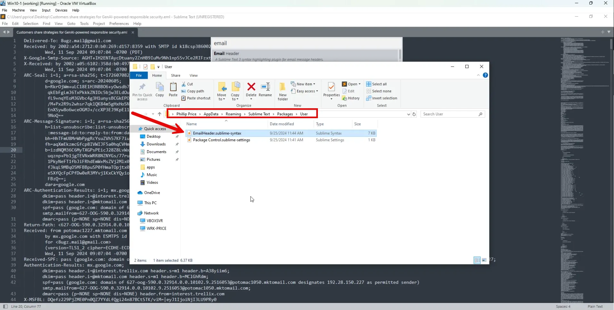

Close Sublime Text Editor and reopen it. Open an .eml file with Sublime and choose email in the bottom right corner. Now the email header is formatted in an easy to read format.

## A quick review of how email works.

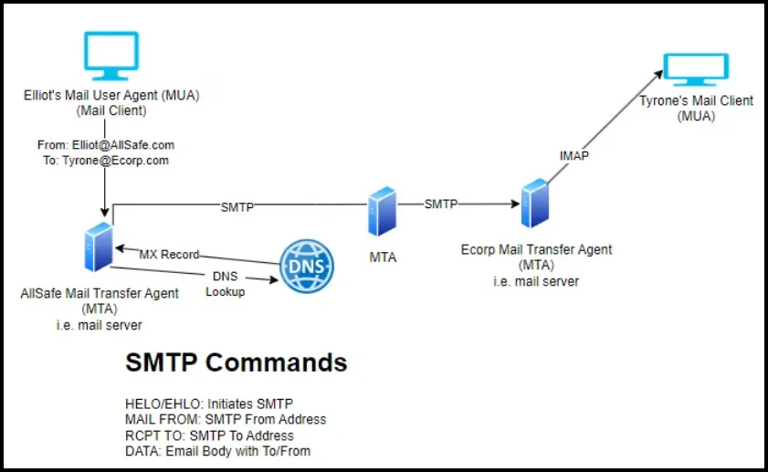

Here's a basic explanation of how email works:

1. **Sending an Email**: When you compose an email, you typically use an email client or a web-based email service like Gmail, Yahoo Mail, or Outlook. In the email client, you provide the recipient's email address, subject, and the content of the message.
2. **Message Formatting**: The email client or service formats your message according to the standards set by the Internet Engineering Task Force (IETF), primarily using the Simple Mail Transfer Protocol (SMTP) for sending emails.
3. **SMTP Servers**: Once you hit "send," your email client connects to an SMTP server (Simple Mail Transfer Protocol server). This server is responsible for sending your email over the internet. You might have configured your email client to use a specific SMTP server provided by your email service provider.
4. **DNS Lookup**: Before the email is sent, the SMTP server performs a Domain Name System (DNS) lookup to find the Mail Exchange (MX) record for the recipient's domain. This record specifies the server responsible for receiving emails for that domain.
5. **Message Delivery**: After locating the recipient's email server, the SMTP server establishes a connection with it and sends the email. The recipient's email server receives the message and places it into the recipient's inbox or a designated folder.
6. **Recipient Retrieval**: The recipient can then retrieve the email by accessing their email account using an email client or web browser. They connect to their email server, typically using protocols like POP3 (Post Office Protocol version 3) or IMAP (Internet Message Access Protocol), authenticate themselves, and retrieve their messages.
    - **IMAP**: IMAP is designed for users who access their email from multiple devices or locations. When you use IMAP to retrieve your emails, the messages remain stored on the email server. It allows you to synchronize your email client with the server, so any changes you make to your emails (such as marking them as read, moving them to folders, or deleting them) are reflected across all your devices.
    - **POP3**: POP3, on the other hand, is more suitable for users who typically access their email from a single device or location. When you use POP3 to retrieve your emails, they are downloaded from the server to your device, and typically, they're removed from the server (though this behavior can be configured). Once downloaded, the emails are usually only accessible on the device where they were retrieved.
7. **Reading the Email**: Once the email is retrieved, the recipient can read it, reply to it, forward it, or take any other desired actions.
8. **Storage and Management**: Email servers store received messages until the recipient decides to delete them. Email clients also often store copies of messages locally on the recipient's device for offline access.
9. **Security Measures**: Throughout this process, various security measures are employed to protect the confidentiality and integrity of the email, such as encryption protocols (e.g., SSL/TLS) during transmission and spam filters to prevent unwanted messages from reaching the recipient's inbox.

This process ensures that emails are reliably delivered from sender to recipient across the internet, facilitating communication over vast distances almost instantly.

## SMTP Commands and Replies

SMTP (Simple Mail Transfer Protocol) is a fundamental protocol for sending email over the Internet. It establishes the rules for how email messages are sent and delivered. SMTP is often described as a "push" protocol because it facilitates the direct transfer of messages from the sender's email server to the recipient's email server.

### SMTP Operation Process

When a user sends an email, their email client (e.g., Outlook or Gmail) uses SMTP to relay the message to the sender's email server. The server then establishes a connection with the recipient's email server and forwards the message using a series of SMTP commands and responses.

### Security and Vulnerabilities

A notable security limitation of SMTP is its lack of built-in encryption, which leaves email content susceptible to interception or tampering. However, this vulnerability can be mitigated by implementing additional security measures, such as Transport Layer Security (TLS), to protect the communication.

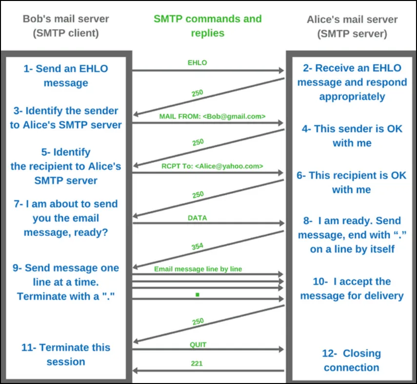


Source: https://www.afternerd.com/blog/smtp

## Email Headers

Email header analysis is the process of examining the metadata contained in an email’s header to determine its origin, trace its path through the mail servers, and identify potential red flags, such as phishing attempts or spoofed messages. 

**Email Header Example**

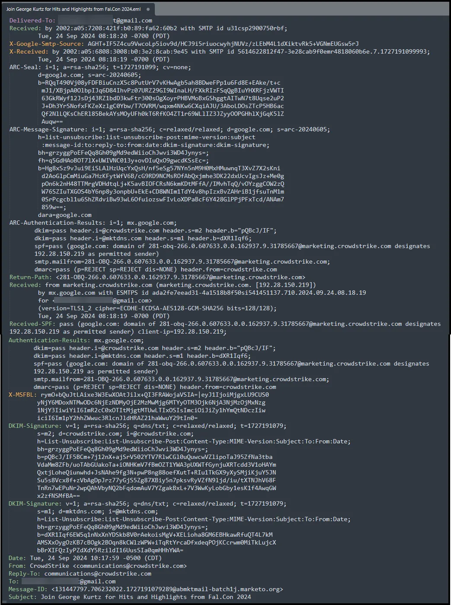

### **Key Elements and Explanations**

### 1. **Delivered-To: ***********@gmail.com**

- This field shows the email address that the message was ultimately delivered to. It is useful in cases where emails are forwarded or if there are multiple recipients. In this case, it indicates the email was delivered to the Gmail account `*******@gmail.com`.

### 2. **Received: by 2002:a05:7208:421f:b0:89:fa62:60b2 with SMTP id u31csp2900750rbf**

- The **Received** header shows the server that received the email and its corresponding IP or host (in this case, an IPv6 address `2002:a05:7208:421f:b0:89:fa62:60b2`). Every time an email hops from one server to another, a new "Received" line is added, giving us a trace of the email’s path. It also provides a timestamp (`Tue, 24 Sep 2024 08:18:20 -0700 (PDT)`), showing when the email was received by this specific server.

### 3. **X-Google-Smtp-Source:**

- This field contains internal information used by Google to help identify the source of the email and track it through their systems. It's mainly useful for Google's internal processes and is not generally used for public analysis.

### 4. **ARC-Seal and ARC-Message-Signature:**

- ARC (Authenticated Received Chain) headers are part of an authentication system. They allow intermediaries (like Google's servers) to pass along authentication results as the message moves through different mail systems. In this example, the signature (`i=1`) was successfully applied by `google.com` using `rsa-sha256` encryption. It verifies that this email wasn't tampered with in transit between servers.

### 5. **ARC-Authentication-Results:**

- This section shows the results of authentication checks performed by Google's email system:
    - **DKIM** (DomainKeys Identified Mail) passed, meaning that the digital signature added by both `crowdstrike.com` and `mktdns.com` verified the email came from legitimate servers for those domains.
    - **SPF** (Sender Policy Framework) passed, confirming that the IP address `192.28.150.219` is authorized to send emails on behalf of `crowdstrike.com`.
    - **DMARC** (Domain-based Message Authentication, Reporting & Conformance) also passed. This verifies that both SPF and DKIM checks align with the domain in the "From" header.

### 6. **Return-Path: 281-OBQ-266.0.607633.0.0.162937.9.31785667@marketing.crowdstrike.com**

- The return path is used to handle bounces (undeliverable emails). It shows the sender's email address used for bounce messages, which, in this case, is a marketing email from `crowdstrike.com`.

### 7. **Received: from marketing.crowdstrike.com (192.28.150.219)**

- This line shows that the email was received from a server at `marketing.crowdstrike.com` with IP address `192.28.150.219`. It adds credibility that this is indeed from CrowdStrike because the IP address resolves to their infrastructure.

### 8. **Received-SPF: pass**

- The SPF check passed, meaning Google's server verified that the email came from an authorized server. This prevents email spoofing by verifying the sender’s IP.

### 9. **DKIM-Signature:**

- DKIM provides a method for validating that the message wasn't altered during transit and that it truly came from the claimed domain. The `m2` selector was used for `crowdstrike.com`, and it passed the verification process.

### 10. **Date: Tue, 24 Sep 2024 10:17:59 -0500 (CDT)**

- This field shows when the email was originally sent. It helps us verify the message's timeline and its alignment with the times in the "Received" headers.

### 11. **From: CrowdStrike communications@crowdstrike.com**

- The sender is listed as `communications@crowdstrike.com`, which matches the authenticated domain seen in earlier headers (SPF and DKIM passed for this domain). This is a marketing communication from CrowdStrike.

### 12. **To: ***********@gmail.com**

- This shows the recipient's address again, confirming that the email was intended for `*********@gmail.com`.

### 13. **Message-ID: 131447797.706232022.1727191079289@abmktmail-batch1j.marketo.org**

- Every email has a unique message ID, which helps to identify it in mail systems. This is useful for tracking specific emails across different systems.

### 14. **Subject: Join George Kurtz for Hits and Highlights from Fal.Con 2024**

- This is the subject line that appears in the recipient's inbox. While it's not directly tied to security analysis, it provides context to the content of the email.

### **What to Learn from this Legitimate Email Header**

1. **Consistency Across Fields**: A legitimate email will have consistent information across all headers. In this case:
    - The `From`, `Return-Path`, and `Received` headers all indicate that the email was sent from `crowdstrike.com`.
    - The SPF, DKIM, and DMARC checks all pass, further proving the email’s authenticity.
2. **DKIM Signature and SPF Checks**: These are essential to verify the legitimacy of the email. The passing status of both means the email was authorized by `crowdstrike.com` and wasn’t altered in transit.
3. **Received Headers Trace the Email’s Journey**: An important part of email header analysis is checking the chain of `Received` headers. A legitimate email should show a clear, logical path through authorized mail servers to the recipient’s server.

By understanding these key fields and learning how to interpret them, cybersecurity analysts can confidently analyze email headers and differentiate between legitimate and malicious emails.

## Email **Authentication**

- **SPF (Sender Policy Framework)**: `spf=pass` confirms that the sending server (192.28.150.219) is authorized to send email on behalf of `crowdstrike.com`.

**Sender Policy Framework (SPF)** is often denoted in the header with a "Received-SPF“ line. It helps authenticate the origin of the message. SPF allows organizations to identify which mail servers are allowed to send email from their domain. It provides an easy means for receiving mail transfer agents to validate the sending IP address to the purported domain. The primary purpose is to prevent spammers from forging messages from a specific domain. Not every mail server will include this information, but you should be suspicious of any failures noted in the email header.

Below is a diagram of how SPF works.

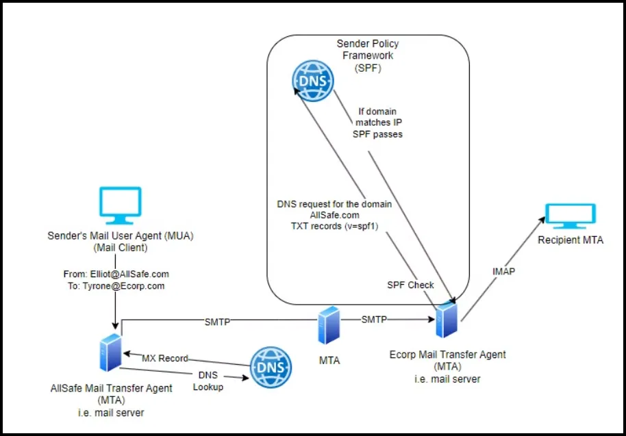

Basically, the receiving mail server performs a DNS query for the sending domain’s TXT record. One of the lines starts with “v=spf1” and then lists IP addresses. If one of those IP addresses matches the sending IP address, the SPF passes.

To demonstrate how SPF works we can use nslookup to retrieve SPF Records.

```go
nslookup -type=txt crowdstrike.com | grep -i spf
```


As seen above, we can see the IP addresses that are authorized to send emails for Crowdstrike.

We also see that spf.salesforce.com and [spf.servicenowservices.com](http://spf.servicenowservices.com) are authorized. That means that the IP addresses from those domains are also authorized to send emails for crowdstrike.com. 

- **DKIM (DomainKeys Identified Mail)**: `dkim=pass` shows that the DKIM signature was verified and that the message has not been altered.

**DomainKeys Identified Mail (DKIM)** information is another mechanism to validate the source and content of a message by allowing the originating server to sign the message with a private key digital signature. DKIM can be used to protect the entire message, or just parts like the “From:'' field. A valid DKIM check authenticates the sending domain with the public key and ensures elements of the message were not changed en route from the original mail server.

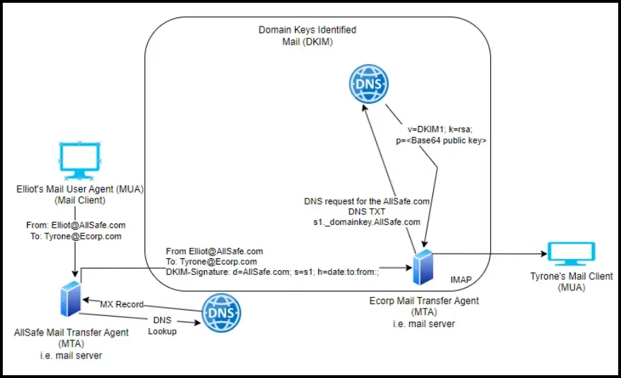

We can demonstrate this from our terminal. 

```go
nslookup -type=txt m2._domainkey.crowdstrike.com
```

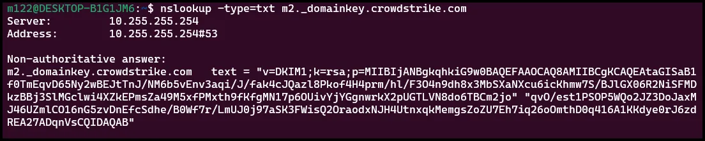

- **DMARC (Domain-based Message Authentication)**: `dmarc=pass` confirms that both SPF and DKIM passed, ensuring the email is from the legitimate domain (`ecorp.com`). Allows domain owners to establish how emails that fail SPF or DKIM are handled.

## Bypassing Email Authentication

Attackers can find ways to bypass or manipulate email authentication systems, but these methods typically involve exploiting weak configurations, vulnerabilities, or user behavior. Here are some common tactics:

1. **Domain Spoofing with Misconfigured SPF or DKIM**
- Attackers can exploit weak or incomplete SPF and DKIM configurations. If the domain hasn’t set up SPF or DKIM properly, it’s easier to spoof that domain’s email address, meaning attackers can send emails that look like they come from a trusted source.
- **Example**: If a domain’s SPF record is not strict, attackers may use a third-party server to send phishing emails that appear legitimate.
1. **Lookalike Domains (Domain Impersonation)**
- Instead of spoofing, attackers might register a domain that looks very similar to a legitimate one. For instance, using “amaz0n.com” instead of “amazon.com.”
- Since the attacker owns this lookalike domain, they can easily pass SPF, DKIM, and DMARC checks because they control the email infrastructure of that domain. The email may seem authentic to the recipient.
1. **Subdomain Spoofing**
- If the main domain has email authentication set up properly but subdomains do not, attackers can exploit this loophole to send emails from a subdomain that looks legitimate but isn’t protected.
- **Example**: An attacker might send emails from “offers.company.com” if only “company.com” has SPF and DKIM, while the subdomain doesn’t.
1. **Compromised Email Accounts**
- Instead of bypassing authentication systems, attackers can take over legitimate email accounts through phishing or weak credentials. Once inside, they don’t need to worry about SPF, DKIM, or DMARC since the emails will come from valid accounts.
- **Example**: If an attacker compromises the CEO’s email account, any emails they send will appear authentic because they’re using the real account.
1. **Exploiting Weak DMARC Policies**
- If a domain’s DMARC policy is set to "none," it means that even if SPF or DKIM checks fail, no specific action will be taken (such as rejecting the email). Attackers can exploit this by sending emails that fail authentication but still reach the inbox.
- **Example**: A company might publish a DMARC record but not enforce it, allowing attackers to send spoofed emails without consequence.
1. **Third-Party Services Not Covered by SPF/DKIM**
- Organizations may use third-party services (like marketing or newsletter platforms) to send emails. If these services are not added to the SPF record or not properly configured with DKIM, attackers can impersonate these services.
- **Example**: An attacker can send a phishing email pretending to be a marketing email from a third-party service used by the company, and it might not trigger any security flags.
1. **Social Engineering**
- Even if email authentication is correctly set up, attackers can still craft emails that look convincing enough for users to fall for scams. They might create fake internal emails (e.g., a CFO sending a payment request) or impersonate trusted third parties to trick recipients into clicking malicious links.
- **Example**: An attacker might send an email from “it.support@companv.com” (using a lookalike domain), hoping recipients won’t notice the slight change and click on a phishing link.

In summary, while email authentication mechanisms like SPF, DKIM, and DMARC are strong defenses, attackers can still get around them by exploiting configuration weaknesses, leveraging lookalike domains, or using compromised accounts. It’s essential to combine email authentication with user training and other security measures to minimize the risk.

## Phishing Email Header Example

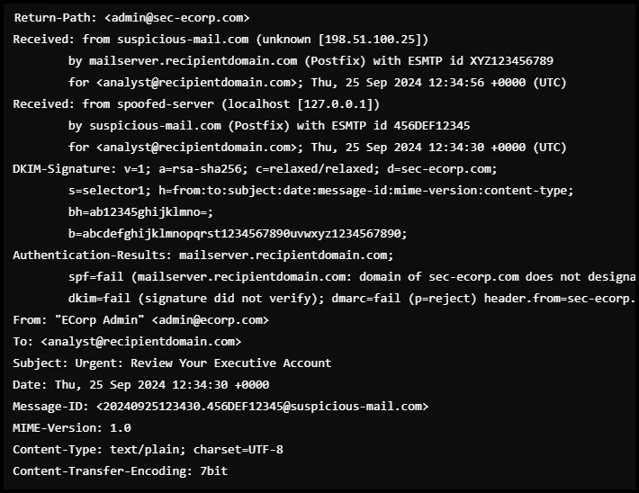

### **Key Elements and Explanations**

### 1. **Return-Path: `<admin@sec-ecorp.com>`**

- **Explanation**: The `Return-Path` address is the email address where any bounced messages (e.g., non-deliverable emails) would be returned. While this field looks somewhat legitimate (`admin@sec-ecorp.com`), it includes a subtle variation (`sec-ecorp.com`) of the real domain (`ecorp.com`). This is a common tactic used in phishing attacks to trick users who don’t closely inspect the email address.
- **Red Flag**: The slight alteration in the domain name (`sec-ecorp.com`) indicates a likely phishing attempt, as the real email domain should be `ecorp.com`.

### 2. **Received Headers:**

- These headers are crucial for tracing the journey of the email. Legitimate emails should have a clear and logical flow between mail servers. Here’s what stands out in this phishing attempt:

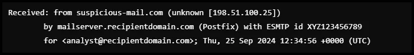

- **Explanation**: The email was received from `suspicious-mail.com`, which is a questionable domain. The IP address `198.51.100.25` does not belong to the legitimate `ecorp.com` mail server. The domain `suspicious-mail.com` is a strong indicator that the email originated from a non-trusted source.
- **Red Flag**: The sending domain and IP address should be associated with `ecorp.com`, but in this case, they are not.

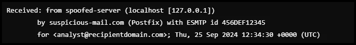

- **Explanation**: The second `Received` line shows the email was sent from a `localhost` address (`127.0.0.1`), which is highly suspicious. This means the email may have been generated locally on a compromised machine and relayed through `suspicious-mail.com`, which is not typical for legitimate emails.
- **Red Flag**: Emails should not originate from `localhost` in a normal email flow, and this shows possible spoofing or server abuse.

### 3. **DKIM-Signature:**

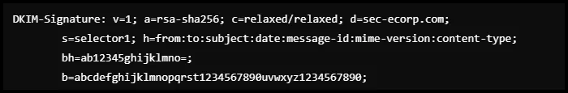

- **Explanation**: The **DKIM-Signature** provides cryptographic proof that an email was not altered in transit. Here, the domain in the DKIM signature is `sec-ecorp.com` instead of the legitimate `ecorp.com`. The DKIM signature would be used to verify the email, but in this case, the domain is incorrect.
- **Red Flag**: The DKIM domain (`sec-ecorp.com`) does not match the real domain, indicating potential spoofing. Additionally, the DKIM check failed (as seen in the Authentication-Results), meaning the signature could not be verified.

### 4. **Authentication-Results:**

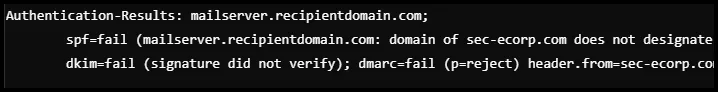

- **Explanation**: This field summarizes the results of SPF, DKIM, and DMARC checks:
    - **SPF (Sender Policy Framework)**: The SPF check fails because the IP address `198.51.100.25` is not authorized to send emails on behalf of `sec-ecorp.com`.
    - **DKIM (DomainKeys Identified Mail)**: The DKIM signature also fails verification, suggesting the email may have been tampered with or is not legitimate.
    - **DMARC (Domain-based Message Authentication)**: The DMARC check fails, meaning both SPF and DKIM failed, and the email should be rejected based on the domain's policy.
- **Red Flag**: All email authentication mechanisms (SPF, DKIM, and DMARC) fail, indicating the email is fraudulent and likely spoofed.

### 5. **From: `"ECorp Admin" <admin@ecorp.com>`**

- **Explanation**: The "From" field displays `admin@ecorp.com`, but this is a spoofed address. Attackers often spoof the "From" field to make the email appear as if it came from a trusted source. However, based on the earlier headers (SPF and DKIM failures), this "From" field is not legitimate.
- **Red Flag**: While the "From" field looks like a legitimate `ecorp.com` address, the underlying email infrastructure (shown in the `Received` headers) reveals that the email didn’t originate from `ecorp.com`.

### 6. **To: `<analyst@recipientdomain.com>`**

- **Explanation**: This field correctly shows the email is addressed to the intended recipient. This field, in itself, doesn’t reveal any phishing intent but should be checked in conjunction with other fields.

### 7. **Subject: `Urgent: Review Your Executive Account`**

- **Explanation**: The subject uses urgency to encourage the recipient to take immediate action, which is a common tactic in phishing emails. Phrases like "Urgent" and "Executive Account" are meant to draw the recipient’s attention and prompt them to click without thinking critically.
- **Red Flag**: The use of urgency combined with the suspicious technical details (SPF, DKIM failures) is a sign of phishing.

### 8. **Message-ID: `<20240925123430.456DEF12345@suspicious-mail.com>`**

- **Explanation**: The **Message-ID** is unique to the email and should generally match the domain of the sending server. In this case, it’s from `suspicious-mail.com`, which does not match `ecorp.com`, further suggesting that this email is not from a legitimate source.
- **Red Flag**: The mismatch between the "From" field and the domain in the Message-ID is another indicator of a phishing attempt.

### **Sample Bad Email Header**

```go
Return-Path: <fake@maliciousdomain.com>
Received: from unknownhost.maliciousdomain.com (malicious-ip [192.168.0.123])
        by recipient-server.com (Postfix) with ESMTP id 123456789ABC
        for <victim@recipientdomain.com>; Mon, 25 Sep 2024 12:34:56 +0000 (UTC)
Received: from trustedserver.paypal.com (trustedserver.paypal.com [198.51.100.45])
        by unknownhost.maliciousdomain.com with ESMTP id ABCD1234EFGH
        for <victim@recipientdomain.com>; Mon, 25 Sep 2024 12:34:00 +0000 (UTC)
From: "PayPal" <service@paypal.com>
To: victim@recipientdomain.com
Subject: Urgent: Your account is at risk!
Date: Mon, 25 Sep 2024 12:34:56 +0000
Message-ID: <12345@maliciousdomain.com>
MIME-Version: 1.0
Content-Type: text/plain; charset=UTF-8
Content-Transfer-Encoding: 7bit
DKIM-Signature: v=1; a=rsa-sha256; d=paypal.com; s=selector1; c=relaxed/relaxed;
    q=dns/txt; h=From:Subject:Date:Message-ID; 
    bh=xyzxyzxyzxyzxyzxyzxyzxyz=;
    b=abcdef1234567890abcdef1234567890;
Authentication-Results: recipient-server.com;
    spf=fail (recipient-server.com: domain of maliciousdomain.com does not designate 192.168.0.123 as permitted sender);
    dkim=fail (signature did not verify);
    dmarc=fail (p=quarantine) header.from=paypal.com
X-Spam-Status: Yes, score=5.0
X-Spam-Flag: YES

```

**Key Points of this Spoofed Header:**

- **Return-Path**: The Return-Path is set to <fake@maliciousdomain.com>, which is clearly not from PayPal.
- **Received Headers**: It shows that the email passed through an unknown server (malicious-ip) rather than an authorized PayPal server.
- **From**: The "From" field says service@paypal.com, which looks like it’s from PayPal, but this is spoofed to trick the user.
- **Message-ID**: The Message-ID is from maliciousdomain.com instead of paypal.com, indicating a mismatch.
- **Authentication-Results**: SPF, DKIM, and DMARC all fail, signaling potential forgery.
- **X-Spam-Status**: The email is flagged as spam due to suspicious activity.

**Sample Bad Email Header #2**

```go
Return-Path: <admin@secure-ecorp.com>
Received: from compromisedhost.attacker.com (compromised-ip [172.16.1.10])
        by mail.ecorp.com (Postfix) with ESMTP id 7890ABC123
        for <pprice@ecorp.com>; Tue, 25 Sep 2024 10:15:30 +0000 (UTC)
Received: from legitimate.ecorp.com (legitimate.ecorp.com [203.0.113.75])
        by compromisedhost.attacker.com with ESMTP id ABCD5678XYZ
        for <pprice@ecorp.com>; Tue, 25 Sep 2024 10:15:00 +0000 (UTC)
From: "ECorp Admin" <admin@ecorp.com>
To: pprice@ecorp.com
Subject: Important: Password Reset Request
Date: Tue, 25 Sep 2024 10:15:30 +0000
Message-ID: <67890@attacker.com>
MIME-Version: 1.0
Content-Type: text/html; charset=UTF-8
Content-Transfer-Encoding: quoted-printable
DKIM-Signature: v=1; a=rsa-sha256; d=ecorp.com; s=default; c=relaxed/relaxed;
    q=dns/txt; h=From:Subject:Date:Message-ID;
    bh=abcdefghijk1234567890==;
    b=lmnopqrstuvwxyz1234567890abcdef;
Authentication-Results: mail.ecorp.com;
    spf=fail (mail.ecorp.com: domain of attacker.com does not designate 172.16.1.10 as permitted sender);
    dkim=fail (signature did not verify);
    dmarc=fail (p=reject) header.from=ecorp.com
X-Spam-Status: Yes, score=6.5
X-Spam-Flag: YES

```

**Key Points of this Spoofed Header:**

- **Return-Path**: The Return-Path is <admin@secure-ecorp.com>, which looks similar to the real domain but is a lookalike domain.
- **Received Headers**: The email claims to have originated from legitimate.ecorp.com, but the actual sending server is compromisedhost.attacker.com with the IP address 172.16.1.10, indicating a spoofed email.
- **From**: The "From" field uses admin@ecorp.com, which seems legitimate but is actually spoofed.
- **Message-ID**: The Message-ID is generated from the attacker's domain attacker.com, not ecorp.com.
- **Authentication-Results**: The SPF, DKIM, and DMARC results all fail, meaning the email didn’t come from an authorized sender for ecorp.com.

**X-Spam-Status**

: The email is flagged as spam due to a high spam score and failed authentication checks

## Online Email Header Analyzers

MX Toolbox (https://mxtoolbox.com/EmailHeaders.aspx)

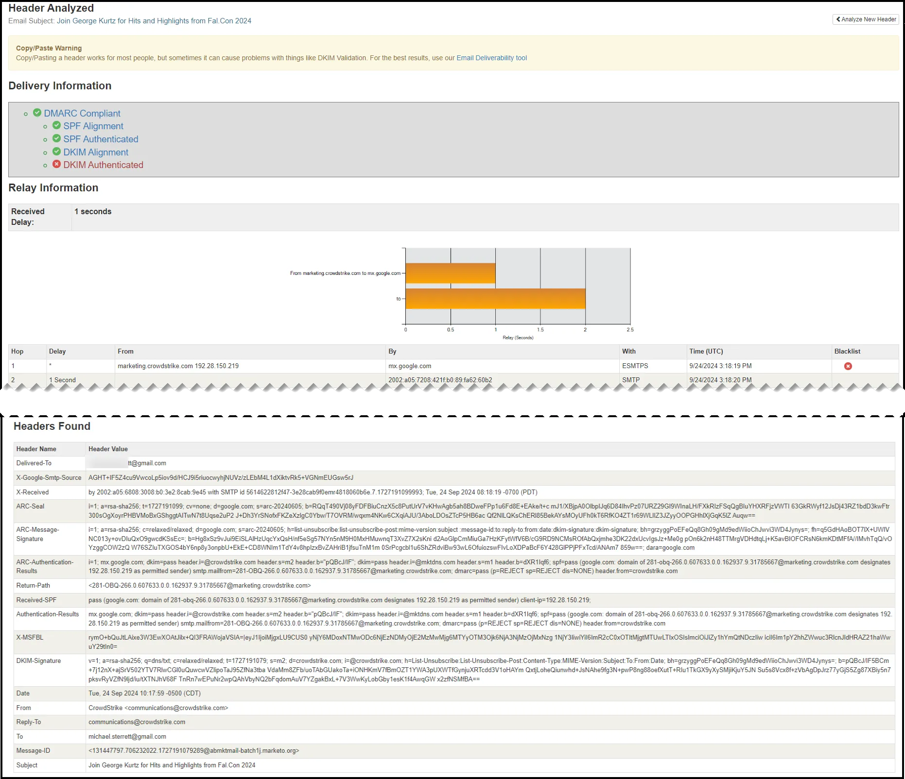

Microsoft (https://mha.azurewebsites.net/)

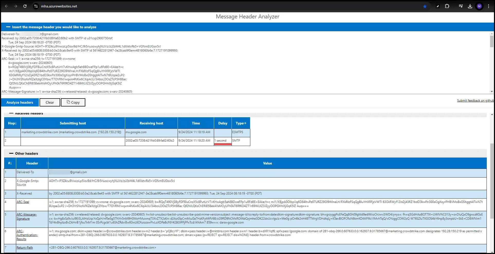

 

## General Email Analysis Tips

**Identifying the Actual Sender:** By examining the 'Received' lines, you can trace the email's path. The first 'Received' line at the top is the most recent server it passed through. If an email claims to be from a legitimate company but the path shows different servers, it might be suspicious.

**Checking for Consistency:** Verify if the 'Return-Path', 'Received', and 'From' fields are from the same domain. Discrepancies can indicate spoofing.

**Analyzing Timestamps:** Check the timestamps in the 'Received' lines. Unusual time delays or odd time zones could indicate a falsified email.

**Verifying DKIM and SPF Records:** These are email authentication methods. A failed DKIM (DomainKeys Identified Mail) or SPF (Sender Policy Framework) check **could** indicate that the email is not from the purported sender.

**Tracing IP Addresses:** 'Received' lines often include IP addresses of the mail servers. Use IP lookup tools to check the locations and authenticity of these servers

**Spotting Unusual Patterns:** Look for patterns like strange formatting, unfamiliar server names, or other inconsistencies.

**Caution with Links and Attachments:** If the email contains links or attachments, be cautious. Analyze the URL by hovering over it without clicking, to see if it directs to a suspicious site.

**Using Header Analysis Tools:** There are various online tools available that can analyze email headers and highlight suspicious elements.

## Practical Exercise

Download and analyze headers from the five .eml files linked below. Identify why each email header is suspicious and answer the questions in the quiz.

[eml_files.7z](Files/eml_files.7z)

After downloading and unzipping the .eml files, open the first file in Thunderbird by right-clicking the file and select “open with” Thunderbird.

  

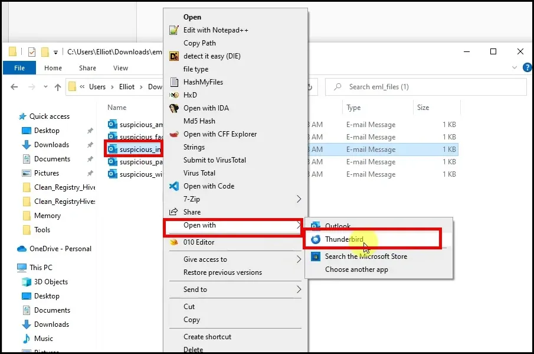

Review the email in Thunderbird and look for obvious anomalies. 

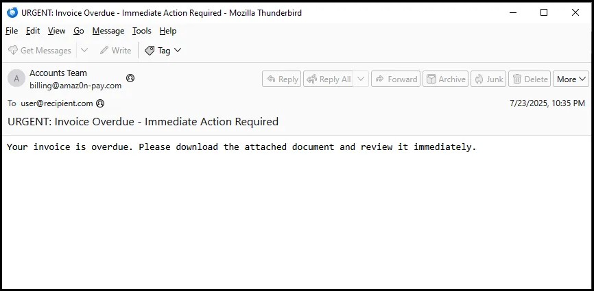

Next, you can view the email header info by selecting View→ Headers → All. Then you can use the scroll bar to view the entire header.

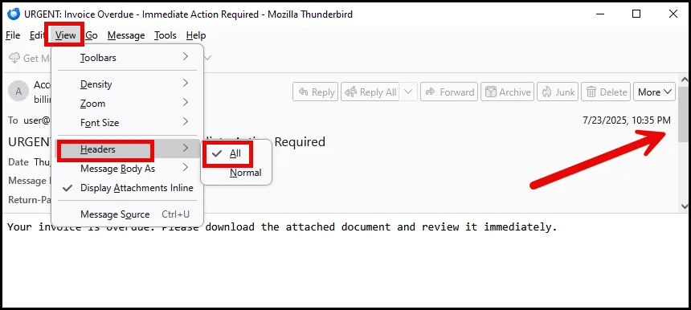

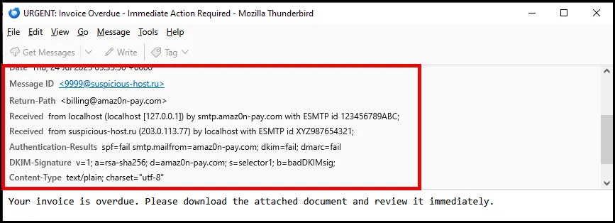

Alternatively, open the .eml file in Sublime text and choose  the email header package on the bottom right.

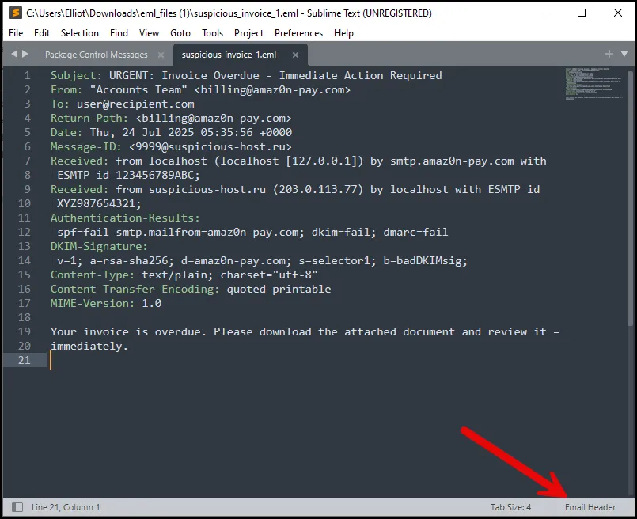

Lastly, you can also copy and paste the email header information to one of the on-line email headers, discussed previously.

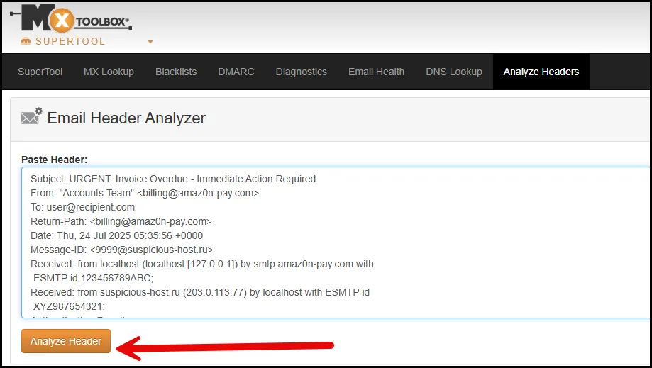

Analyze each

## Email with Attachment Sample

```powershell
Delivered-To: [8ugz.mail@gmail.com](mailto:8ugz.mail@gmail.com)
Received: by 2002:a92:bd02:0:0:0:0:0 with SMTP id c2csp3604485ile;
Fri, 31 May 2024 22:41:18 -0800 (PST)
X-Google-Smtp-Source: ABdhPJxMrOAiiW/tZAHOxAwohqg8F8fLpv1xou4CoJ8r9tPXaBGlDruGLq5PtDzenNW5arGU5A99
X-Received: by 2002:adf:9b92:: with SMTP id d18mr4483603wrc.170.1611643278636;
Fri, 31 May 2024 22:41:18 -0800 (PST)
ARC-Seal: i=1; a=rsa-sha256; t=1611643278; cv=none;
[d=google.com](http://d=google.com/); s=arc-20160816;
b=hedJHzoAUpL4fSk43IZn1a4IxMtoAw3SxCmqyefMYowCr5P8cUwV6ZZPNCjSjQXlXe
5NtMZQ5klqjPo2Pt7XZbK2X9DZfKIfqsZFw2IoGm1/q9FiPvXlv/Ob7s7WL9l7Do+4y0
jRlfqFJ7RXwZaTKVUJk5FjyxR+PAsMTerOHzbGZBb5PuWscS+kRzwJ+8ktN/vm7E9C6/
4md9RAKtLW3wpnsHarorYjo0sz/x1hqLUSK7gvqukXo9QCVwdQOs4h1lQ9G3LZMT5QMU
kvBZXstcDfuwQBI99LIhs0RsiylE8r0qU0N39gI0IMupEXV7oQxAVGofic2dRgAP1jUe
lgAA==
ARC-Message-Signature: i=1; a=rsa-sha256; c=relaxed/relaxed; [d=google.com](http://d=google.com/); s=arc-20160816;
h=date:message-id:mime-version:reply-to:errors-to:importance:from
:subject:to;
bh=GfMK2s9MDbqBDZeyMDCQoZLpa7Z72oNds1X0SgpqoDs=;
b=VlLJrpR1Dzc0LUdlnU4WvAn9c2tV54CNGDtba7AyTQmRXWjoPzpad25jlZ5eOt6OdJ
bvqSxiY0ovvAiSfUIPkcsGcPXnJyd8RfaG0WTJXOCcKwQh0dE2pxhEcok5GCkAtVQTqd
Ebjj4vKG1/+e5E5KVan5X/KAKDJ1EWxpJnpB9YLW1Fn07Lm/xAVpmfoFo8xw7xc82Urr
mXbeSoIf1E5/SOYr9Y/wvQa0X/fZpx3hXqgalEdw4Dq4JCUfldzI9x1wI+F7ckiCneci
GWDcoNBZCiE6T8DvVPNbDK4KZap03JE62nfph6zUKm8NfYorfQTt3GVbr/iKxEq2G5WN
V1cw==
ARC-Authentication-Results: i=1; [mx.google.com](http://mx.google.com/);
spf=fail ([google.com](http://google.com/): domain of [elliot@allsafe.com](mailto:elliot@allsafe.com) does not designate 1.1.145.150 as permitted sender) [smtp.mailfrom=elliot@allsafe.com](mailto:smtp.mailfrom=elliot@allsafe.com)
Return-Path: [Tyrell@ECorp.com](mailto:Tyrell@ECorp.com)
Received: from localhost ([wtf.co.th](http://wtf.co.th/) [1.1.145.150])
by [mx.google.com](http://mx.google.com/) with ESMTPS id s16si170171wmj.176.2021.01.25.22.41.18
for [8ugz.mail@gmail.com](mailto:8ugz.mail@gmail.com)
(version=TLS1_2 cipher=ECDHE-ECDSA-CHACHA20-POLY1305 bits=256/256);
Fri, 31 May 2024 22:41:18 -0800 (PST)
Received-SPF: fail ([google.com](http://google.com/): domain of [elliot@allsafe.com](mailto:elliot@allsafe.com) does not designate 1.1.145.150 as permitted sender) client-ip=1.1.145.150;
Authentication-Results: [mx.google.com](http://mx.google.com/);
spf=fail ([google.com](http://google.com/): domain of [elliot@allsafe.com](mailto:elliot@allsafe.com) does not designate 1.1.145.150 as permitted sender) [smtp.mailfrom=elliot@allsafe.com](mailto:smtp.mailfrom=elliot@allsafe.com)
Received: by localhost (Postfix, from userid 33)
id 1993E221F8; Tue, 31 May 2024 22:41:18 -0800 (PST)
To: [8ugz.mail@gmail.com](mailto:8ugz.mail@gmail.com)
Subject: Fun Society Vouchers
From: "Elliot" [elliot@allsafe.com](mailto:elliot@allsafe.com)
X-Priority: 3 (Normal)
Importance: Normal
Errors-To: [elliot@allsafe.com](mailto:elliot@allsafe.com)
Reply-To: [j2024@restore.com](mailto:j2024@restore.com)
MIME-version: 1.0
Content-Type: multipart/mixed; boundary=BOUND_600FB98E0DCEE8.49207210
Message-Id: [20210126064118.1993E221F8@localhost](mailto:20210126064118.1993E221F8@localhost)
Date: Tue, 31 May 2024 22:41:18 -0800 (PST)
-BOUND_600FB98E0DCEE8.49207210
Content-Type: text/plain; charset=utf-8
Content-Transfer-Encoding: base64
SGksDQpZb3UgaGF2ZSBiZWVuIGNob3NlbiB0byByZWNlaXZlIGZyZWUgZ2FtZSB2b3VjaGVycyBmcm9tIEZ1blNvY2lldHkuIEFsbCB5b3UgaGF2ZSB0byBkbyBpcyBjb21wbGV0ZSB0aGUgcXVlc3Rpb25zIGluIHRoZSBwZGYgYXR0YWNobWVudCB0byByZWNlaXZlIHRoZSBmcmVlIHZvdWNoZXJzISEh
-BOUND_600FB98E0DCEE8.49207210
Content-Type: application/pdf; name="FunSociety.pdf"
Content-Transfer-Encoding: base64
Content-Disposition: attachment; filename="FunSociety.pdf"
UEsDBBQAAAAAAANrv1gAAAAAAAAAAAAAAAALAAAARnVuU29jaWV0eS9QSwMEFAAAAAgAhGu/WM+Od16EAQAAfgIAACQAAABGdW5Tb2NpZXR5L0Z1blNvY2lldHkgLSBTaG9ydGN1dC5sbmuFUU1IAlEQ/qwoxYuSCEWRRdEhWlc9JQRCKRKW0kJ12MDSRQX/cM2fUychog516RSECJ46RNCtHwqCbh3FLh2jDkZ0i6DZdRdSoWaYfd/3vdmZee/5AGhMXZDsBrJ5vqCFhYC+8n3E3tU0CwdP5vXzukbleOnFkPQfWq0EE0YCz/5Hy6szZijXtJhi2eMBWOecPDptBXYVUrtQIswIBQEu6NCDxpW6w+AvCyGBMOUIKFAAZooohTyesk4ruREKI0W3RLaNSwZppdFWY8lwKi/yXFHMCgmHXRUCqbyQ4aJCPM7nbAzLpyUuSlweFP1gyPnOb9tUXYSslG0l3SJjD7aQBIcUKTHKyKJI+iY2CI1iAhxxkbBAdZaRIs+SyrfoDthlxQs3fOQSZ6hrnDzYPOXJmnLyfCxpY3/dWr3vYeezlPNXP3Tmi4j+vrx7O35oahgv37WYfDPo/tt3Uw0d1Z+h1cYFuDNzYv50P+2tel1MZbawN6y8ArwU14uDmWbb4Fj78/0AUEsDBBQAAAAIANFRv1jpARyacwIAAEcGAAAZAAAARnVuU29jaWV0eS9GdW5Tb2NpZXR5LmJhdK1UTW8aMRD9Kz5YAiTWYhslJVntoRCokFoSQaIeohwW7wBujL2xvYG0yn/v7CeQQpJDfPF65s3zvGevE70GY5cgJfHWZCniGBTxlE6IxwmNwoZ//oX5Z13mM/+82wjoLPRPTr4GlIdjWHtXs9/AHbHP1sGKKXDMav4AzjLHEy4FKBdQNdvFTgts79nB3T2hnE2Ag3iCXjqfg5mKPxBQ/UbF2enpyVlA4QOQUCFC7yFuYOPY7c2wO1Bcx0ItApocILoU0UJp6wS37NpoDtYikE1dZNxIzTUbCgnjaAVhg69iBhto7OVRVCwMEmJExZGJRypJXei/DbpK3QdQA2O0eQ26tTDNTnGwAZ46CDsBfQwrRLMVUGHL5bYd9LkObrdH36rodrsMaiCKQ5xZL8LNHC7RcFgINcFEE8+sTTptgjP7AWrhlvitUinLqYW8JQUco4CSAo5ScMa1UmhGk0ZtOsOIDTH4HVzBhkrXSzwa0qTOpNAifwkOm5ngWQmA13pF/E4nyMJijrBCFxvZvl4lEhzExEPhpEpMwKbS4S8BpJPR5YOa10YMVJxrKMtaQQm07JcRDnJ7Om1qdhJDmdplswp8gsEZzUstDI4Jg3eEwWFhcEQYvCPsE459TxhucBm56NtTJGQ0k7DbO+YKSpU3pSrCjKKuN8RD3X5WV48Z9vSAoGInkBaKbKXJZb6U1wwfDdygVl0P/MXYOvcE8XXmZb95zvrFBYY4tz6/psTTpsjlLya71lI2/fZd+RiN8Vmdls/qFCQW/9Qx3F9cFItMcas42y1FZQ9ywyMecKl2q3W/rYQNNsL1kTbrqvD9cElW8//4B1BLAQI/ABQAAAAAAANrv1gAAAAAAAAAAAAAAAALACQAAAAAAAAAEAAAAAAAAABGdW5Tb2NpZXR5LwoAIAAAAAAAAQAYAC5mvFZ/s9oBAAAAAAAAAAAAAAAAAAAAAFBLAQI/ABQAAAAIAIRrv1jPjndehAEAAH4CAAAkACQAAAAAAAAAIAAAACkAAABGdW5Tb2NpZXR5L0Z1blNvY2lldHkgLSBTaG9ydGN1dC5sbmsKACAAAAAAAAEAGADGVkbmf7PaAQAAAAAAAAAAAAAAAAAAAABQSwECPwAUAAAACADRUb9Y6QEcmnMCAABHBgAAGQAkAAAAAAAAACIAAADvAQAARnVuU29jaWV0eS9GdW5Tb2NpZXR5LmJhdAoAIAAAAAAAAQAYAGwNgdtks9oBAAAAAAAAAAAAAAAAAAAAAFBLBQYAAAAAAwADAD4BAACZBAAAAAA=
```