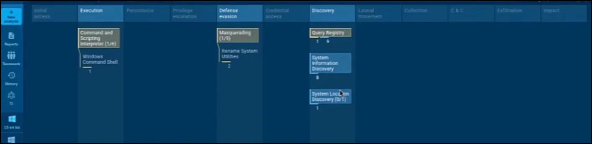
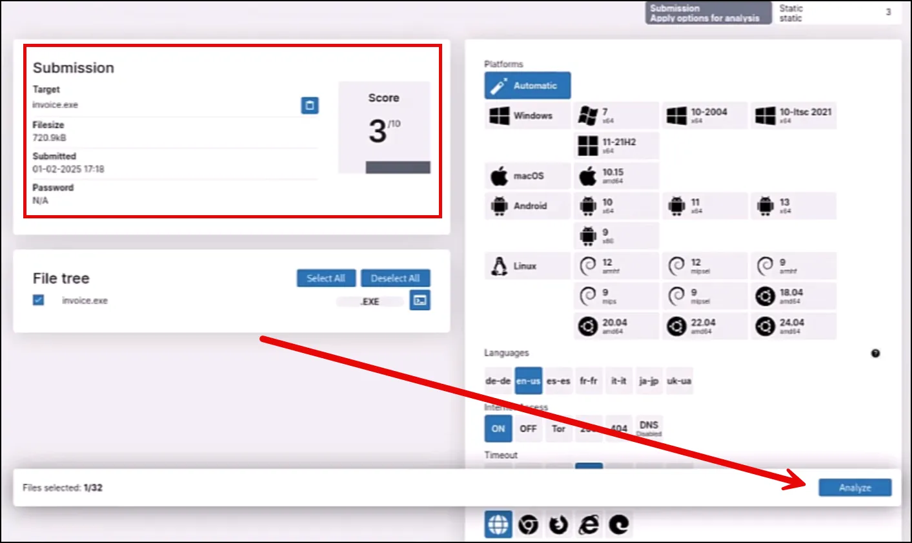

# Analyzing Email Attachments

### Summary

To be clear, this is not a malware analysis section. We will only be doing some very basic triage entry level malware analysis. However, we will be introducing a malware analysis section later in the course. So there would be a whole section on malware analysis. The intent of this particular lesson is to demonstrate how you can triage suspicious files without doing a full scale malware analysis.

**Lab Setup**

The email attachment in this lesson “invoice.exe” is an actual malware sample. You can just watch the video or actually download it and submit it to the sandboxes; however, it is recommended to handle the malware carefully and only in a Linux virtual machine. The malware is designed to be executed in a Windows machine, so it is safer to analyze in a Linux VM. It can be downloaded from the link below and the password is “infected”.

[invoice.exe.zip](Files/invoice.exe.zip)

## VirusTotal

Get the file hash by running the command below in the same directory as you downloaded the file.

```jsx
sha256sum invoice.exe
```


Copy the hash and paste into VirusTotal.


Hit enter, and as seen below the file is malicious and is associated with Qbot (aka Qakbot).


## Sandbox

Using an **online sandbox** for malware analysis provides a safe, efficient, and cost-effective way to examine malicious software without risking local systems. These platforms operate in controlled environments, ensuring malware execution remains isolated from personal or corporate networks. They offer **automated analysis** that quickly generates reports detailing system modifications, network activity, dropped files, and other behavioral indicators, significantly speeding up the triage process.

## Details

Using an **online sandbox** for malware analysis provides several key benefits, especially for cybersecurity professionals, researchers, and analysts. Here’s why they can be a powerful tool:

### **1. Safe and Isolated Execution**

- Online sandboxes run malware in a controlled environment, preventing infections from spreading to your own systems or network.
- They operate in **virtualized environments** or cloud-based infrastructure, reducing risk to local machines.

### **2. Quick and Automated Analysis**

- Most online sandboxes provide **automated reports** detailing malware behavior, system modifications, network communications, and dropped files.
- This speeds up the triage process and helps analysts focus on deeper investigations when necessary.

### **3. Behavioral Insights**

- Online sandboxes monitor how malware interacts with the system, including:
    - File system changes
    - Registry modifications
    - Network connections (C2 communication)
    - Process creation and memory injection
- This allows analysts to detect **hidden behaviors** that may not be obvious in static analysis.

### **4. Access to Multiple Environments**

- Many sandboxes allow testing in different OS versions (Windows, Linux, macOS) and configurations.
- Some offer **emulation of real-world scenarios**, such as running with user privileges or checking persistence across reboots.

### **5. Network Traffic Capture**

- Online sandboxes often provide **packet capture (PCAP) files** and **DNS/HTTP logs** to analyze network traffic.
- This helps identify indicators of compromise (IOCs) and track malicious domains or IP addresses.

### **6. Detection of Evasion Techniques**

- Advanced sandboxes detect malware that tries to evade analysis by checking for:
    - Sandbox detection techniques
    - Anti-VM or anti-debugging behavior
    - Time-delayed execution
- Some sandboxes use **API hooking** to catch stealthy behavior.

### **7. Threat Intelligence Integration**

- Many online sandboxes **automatically correlate results** with threat intelligence feeds, providing:
    - Malware family classification
    - Known signatures and hash matches
    - Links to previous similar samples

### **8. Collaboration and Sharing**

- Some platforms allow analysts to **share reports** with a broader community or submit samples to public threat databases.
- This fosters collaborative threat hunting and enhances security research.

### **9. No Infrastructure Requirements**

- Unlike setting up a local malware lab with tools like FLARE-VM or Cuckoo Sandbox, online services require **no setup or maintenance**.
- This is ideal for quick investigations or when local resources are limited.

### **10. Cost-Effectiveness**

- Many online sandboxes offer **free tiers** for basic analysis.
- Paid versions provide more features, such as longer execution times, multiple VMs, or detailed forensic reports.

### **11. Popular Online Sandboxes**

- **Any.Run** – Interactive, real-time sandbox
- **Hybrid Analysis** – CrowdStrike-powered malware analysis
- **VirusTotal Dynamic Analysis** – Google’s sandbox for behavioral reports
- **Joe Sandbox** – Advanced, deep-dive malware analysis
- **VxStream Sandbox** – Enterprise-grade automated malware analysis
- **tri.age** – Recorded Future’s high-speed malware analysis platform

# Any.Run

ANY.RUN is an interactive malware analysis sandbox that allows users to analyze suspicious files and URLs in a controlled, cloud-based environment. Unlike traditional automated sandboxes, ANY.RUN enables real-time interaction with the virtual machine, allowing analysts to manually execute malware, observe its behavior, and interact with the infected system. It provides detailed process tree visualization, network traffic analysis, registry modifications, and file system changes, making it particularly useful for dynamic analysis of evasive malware. The platform supports multiple Windows OS versions and integrates with various threat intelligence sources to enhance detection and analysis capabilities.

Navigate to https://app.any.run/#register and register for an account. If you already have an account sign in.

Upload invoice.exe to Anyrun by selecting “+New Analysis” and then select the upload button.


Navigate to where the where invoice.exe (or the file you want to run) is located and select Open.


If using a free version of AnyRun, select “Run a public analysis”.


The types of results are highlighted below.


### Text Report


## IOCs


### ATT&CK



### Behavior Graph


# Triage

Recorded Future's Triage is a cloud-based malware sandbox designed for automated and interactive analysis of suspicious files, URLs, and scripts. It provides rapid, in-depth behavioral analysis by executing samples in a controlled environment and extracting key indicators of compromise (IOCs), including network connections, file modifications, and registry changes. Triage supports multiple operating systems and includes advanced anti-evasion techniques to detect stealthy malware. Integrated with Recorded Future’s threat intelligence platform, it enriches analysis results with contextual threat data, helping security teams quickly assess and respond to emerging threats.

Navigate to https://tria.ge/ to create an account or login.

Once logged in, go to the Quick Submit section and select Browse.


Navigate to where the sample you want to run and select Open.


Select submit


The initial score is from a quick static analyis. Select Analyze to detonate the sample.



As seen below, the sample is malicious and has been identified as Qakbot (aka QBot).


These findings include the malware config file that identifies hard coded IP addresses. 


Qakbot will call out to one of those IP addresses. If it's successful then it will download the secondary payload and not call out to any ther IP address. However, if the connection is not successful in that first IP address then it just goes down the list to the next IP address. So basically, Qakbot is updated almost on a daily basis and they hard code a number of IP addresses because they know that these IP addresses will eventually get discovered and be blocked. So that's why they list numerous IP addresses in the configuration file

Also includes processes.


### Conclusion

Depending on your experience level and how your organization is set up. At this point the case may be closed. This is Qakbot. We've blocked what we discovered and searched through the network to make sure that it wasn't delivered anywhere else. You could be done with it. Of course we're not gonna stop here.  In the next lesson we're going to go into dynamic analysis where we will actually execute the malware and analyze for ourselves to see what the malware is doing.

Online sandboxes are great for triaging and quick analysis; however, nothing replaces doing the dynamic analysis yourself.